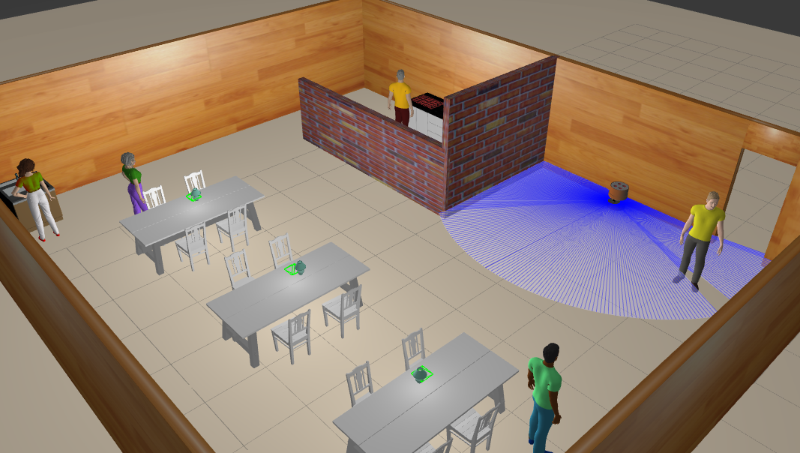
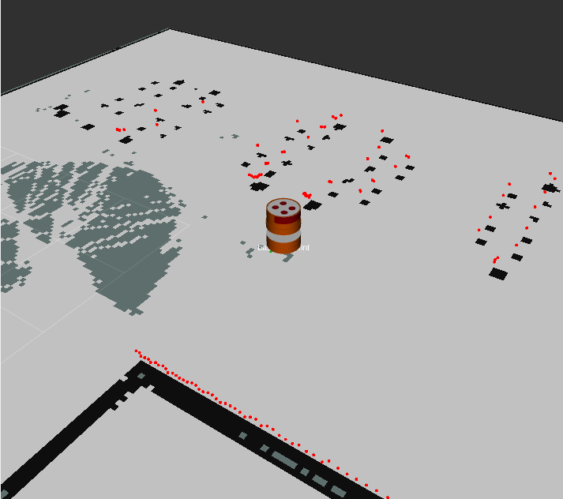
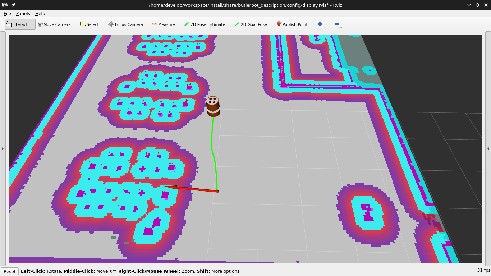

# Butler Robot


## Overview

The Butlerbot project aims to develop a robotic butler designed to operate in a café environment. The robot will autonomously deliver food from the kitchen to customers at their tables, optimizing efficiency and reducing the need for human staff during busy hours.


## Development Environment

This project uses a Dockerized VSCode devcontainer environment for development, based on the [devcontainer_for_ros template](https://github.com/manojm-dev/devcontainer_for_ros). This setup ensures a consistent development environment across different systems and simplifies the setup process.

You can also choose to develop using a normal ROS host machine with ROS 2 Humble installed if you prefer. However, the Dockerized environment provides additional convenience and consistency for development across various platforms.

## How to Build

### In above mention devcontainer environment

1. use vscode tasks shortcut and choose: `Install Dependencies`
2. use vscode tasks shortcut and choose: `Build RelWithDebInfo`

### In normal ros humble installed in host machine

1. create a workspace
```
mkdir -p butlerbot_ws/src
```
2. Clone this repo in src 
```
cd butlerbot_ws
git clone https://github.com/manojm-dev/butlerbot.git src
```
3. Install Dependencies
```
rosdep install --from-path src --ignore-src
```
4. Building
```
 colon build --sysmlink-install
```


## Usage 

## Building

1) Download gazebo models
```
git clone https://github.com/osrf/gazebo_models.git /home/$USERNAME/.gazebo/models
```

2) Sourcing the workspace

    a) In normal ros installation
    ```
    cd workspace
    source install/setup.bash
    ```
    b) In above devcontianer installtion
    
    - type `sourcews` in terminal for sourcing the workspace or close the terminal and open a new terminal(sourced in .bashrc)

## Launching
### 1) [Complete Launch Setup](docs/complete.md) #TODO
### 2) [Mappping Launch Setup](docs/mapping.md)

### 3) [Navigation launch Setup](docs/navigation.md)

### 4) [OpenRMF launch Setup](docs/openrmf.md)


## Project Structure

The project is organized into several ROS2 packages, each handling different aspects of the robot's functionality:

1. **butlerbot_description**: Contains the robot's URDF/XACRO files and launch files, enabling visualization and simulation of Butlerbot in various environments.
2. **butlerbot_gazebo**: Includes configurations and launch files for simulating Butlerbot in the Gazebo environment, allowing for realistic physics and sensor simulation.
3. **butlerbot_localization**: Manages the robot's localization using SLAM or other localization techniques, ensuring accurate positioning within the café environment.
4. **butlerbot_navigation**: Implements the ROS2 Navigation stack (Nav2) for path planning, obstacle avoidance, and autonomous movement of Butlerbot throughout the café.

## Packages Description

### **1) butlerbot_description**

The butlerbot_description package provides the URDF/XACRO files and launch configurations for visualizing Butlerbot robot. It includes files to manage robot state publishing, visualization in RViz, and other related tools.

#### Launch files

1) **display.launch.py**: Launches the robot state publisher, joint state publisher, joint state publisher GUI, RViz, and Rqt. The default parameters are : `use_sim_time:=true`, `use_jsp:=true` ,`jsp_gui:=false`, `urdf_model:=defalt_location`, `use_rviz:=true` and `use_rqt:=false`.

2) **rsp.launch.py**: Launches the robot state publisher node with configuration parameters. The default parameters are: `urdf_model:=default_location`, `use_sim_time:=true` and future scope parameters `use_gazebo:=true`, `use_gzsim:=false`.

3) **visualize.launch.py**: Launches RViz and Rqt visualization tools with configurable parameters. The default parameters are: `use_sim_time:=true`, `use_rviz:=true` and `use_rqt:=false`

### **2) butlerbot_gazebo**
The butlerbot_gazebo package is responsible for simulating the Butlerbot robot in a Gazebo environment. It includes the necessary configurations to launch the robot within a simulated cafe environment.

#### Launch files

1) **gazebo.launch.py**: Launches the Gazebo simulator with the cafe environment and spawns the Butlerbot robot at its home position


### **3) butlerbot_localization**
The butlerbot_localization package is responsible for managing the robot's localization using techniques such as SLAM (Simultaneous Localization and Mapping) and EKF (Extended Kalman Filter). This package ensures accurate positioning of Butlerbot within the café environment, enabling it to navigate and perform tasks reliably.

#### Configuration Files
1) **ekf.yaml**: Configuration for the EKF node, which fuses sensor data to estimate the robot's pose in the environment.

2) **localization.yaml**: General localization parameters for Butlerbot.

3) **mapper_params_online_async.yaml**: Configuration parameters for the asynchronous SLAM algorithm

4) **mapper_params_online_sync.yaml**: Configuration parameters for the synchronous SLAM algorithm.

#### Launch Files

1) **ekf.launch.py****: Launches the EKF node using the parameters defined in ekf.yaml.

2) **slam_online_async.launch.py******: Launches the asynchronous SLAM algorithm using parameters from mapper_params_online_async.yaml.

3) **slam_online_sync.launch.py**: Launches the synchronous SLAM algorithm using parameters from mapper_params_online_sync.yaml.

4) **amcl.launch.py**: Launches the Adaptive Monte Carlo Localization (AMCL) node for probabilistic localization of Butlerbot within a known map.


### **4) butlerbot_navigation**

The butlerbot_navigation package implements the Navigation2 stack for Butlerbot, providing capabilities such as path planning, obstacle avoidance, and autonomous movement within the café environment. This package is critical for enabling Butlerbot to navigate from its starting position to specific locations like tables and back to the home position.

#### Configuration Files
1) ****nav2_params.yaml**: Configuration file for the Navigation2 stack, defining parameters for the planner, controller, recovery behaviors, and other navigation components.

#### Launch Files
1) **navigation.launch.py**: Launches the Navigation2 stack using the parameters defined in nav2_params.yaml.


## [Videos](https://drive.google.com/drive/folders/1xtEoLK6q4JB-CPlg9b8oIdS7F0rFTPDy?usp=drive_link)