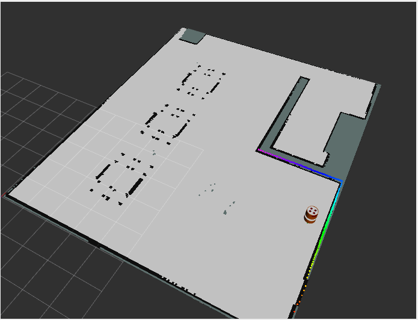

# Butlerbot


## Overview

The Butlerbot project aims to develop a robotic butler designed to operate in a café environment. The robot will autonomously deliver food from the kitchen to customers at their tables, optimizing efficiency and reducing the need for human staff during busy hours.

## [Demonstration](https://drive.google.com/drive/folders/18_-SXzH3Rvvb06oaff-UXDo2nv9DPo-Y): 

### Situations

1) When an order is received with the table number, the robot should move from its home position to the kitchen and move to the table for the food delivery. After completion of that task the robot should return to the home position. (No confirmation is required either from the kitchen or customer table. Getting input from the table or kitchen is your choice.). [[view demonstration video]](https://drive.google.com/file/d/11o15Xs0OAY1DO8EsMbIejADBAhjIUT9I/view?usp=drive_link)

2) When an order is received with the table number, the robot should move from home to start its task. If no one attends the robot, it will wait for Confirmation (either in kitchen or table), the robot should return home after timeout. [[view demonstration video]](https://drive.google.com/file/d/19aB5as6j1NGgi9g80mqRn2TUX0XqsblX/view?usp=drive_link)

3) When an order is received with the table number, the robot should move from home to start its task. We need to handle the following scenario.
+ It will reach the kitchen for the food and if no confirmation is given to the robot it should move to the home position after timeout. [[view demonstration video]](https://drive.google.com/file/d/1PsJzK4sI3hv-ix1wvoS0xZHhqqukC6bL/view?usp=drive_link)
+ If the food is received from the kitchen, it reaches the table. No one is giving confirmation to the robot from the table, then the robot will move to the kitchen first before going to the home position. [[view demonstration video]](https://drive.google.com/file/d/11o15Xs0OAY1DO8EsMbIejADBAhjIUT9I/view?usp=drive_link)

4) When an order is received with the table number, the robot should move from home to start its task. If a task is canceled while going to the table, the robot returns to the kitchen and then to home and if canceled while going to the kitchen, the robot will return to home. [[view demonstration video]](https://drive.google.com/file/d/11o15Xs0OAY1DO8EsMbIejADBAhjIUT9I/view?usp=drive_link)


## Environment setup

This project uses a Dockerized VSCode devcontainer environment for development, based on the [devcontainer_for_ros template](https://github.com/manojm-dev/devcontainer_for_ros). This setup ensures a consistent development environment across different systems and simplifies the setup process.

You can also choose to develop using a normal ROS host machine with ROS 2 Humble installed if you prefer. However, the Dockerized environment provides additional convenience and consistency for development across various platforms.

## How to build it

### 1) In above mentioned devcontainer environment

1. use vscode tasks shortcut `Ctrl+Shift+B` and choose: `Install Dependencies`
2. use vscode tasks shortcut `Ctrl+Shift+B` and choose: `Build RelWithDebInfo`
3. source the workspace (it is a alias for sourcing the default workspace in this setup)
```
sourcews 
```

### 2) In normal ros humble installed in host machine

1. Create a workspace directory with src in it.
```
mkdir -p butlerbot_ws/src
```
2. Clone this repo into src 
```
cd butlerbot_ws
git clone https://github.com/manojm-dev/butlerbot.git src
```
3. Install Dependencies
```
rosdep install --from-path src --ignore-src -y
```
4. Building
```
 colon build --symlink-install
```


## How to run it

1. Launch the gazebo simulation
```
ros2 launch butlerbot_rmf_gazebo simulation.launch.py
```
2. Launch the navigation stack 
```
ros2 launch butlerbot_navigation navigation.launch.py
```
3. Launch the food delivery system action server
```
ros2 run butlerbot_tasks task.py
```
4. Run the action client to order the food
```
ros2 run butlerbot_tasks give_goal.py table_<table_number>  # <table_numbler> = 1 or 2 or 3

# example
ros2 run butlerbot_tasks give_goal.py table2 
```

## Processes

### Mapping (SLAM_TOOLBOX)


Steps to run this

1. Launch the gazebo simulation environment
```
ros2 launch butlerbot_rmf_gazebo simulation.launch.py
```

2. Launch the slam process
- You can choose to use async or sync method by setting `sync:=` true or flase
- You have to modes in `slam_toolbox` either `mapping` or `localization`, you can change between them here by setting `localization:=` true or false.
```
ros2 launch butlerbot_localization slam_online_sync.launch.py sync:=true localization:=false
```

### Localization (SLAM_TOOLBOX)


Steps to run this

1. Launch the gazebo simulation environment
```
ros2 launch butlerbot_rmf_gazebo simulation.launch.py
```

2. Launch the slam process
- You can choose to use async or sync method by setting `sync:=` true or flase
- You have to modes in `slam_toolbox` either `mapping` or `localization`, you can change between them here by setting `localization:=` true or false.
```
ros2 launch butlerbot_localization slam_online_sync.launch.py sync:=true localization:=true
```