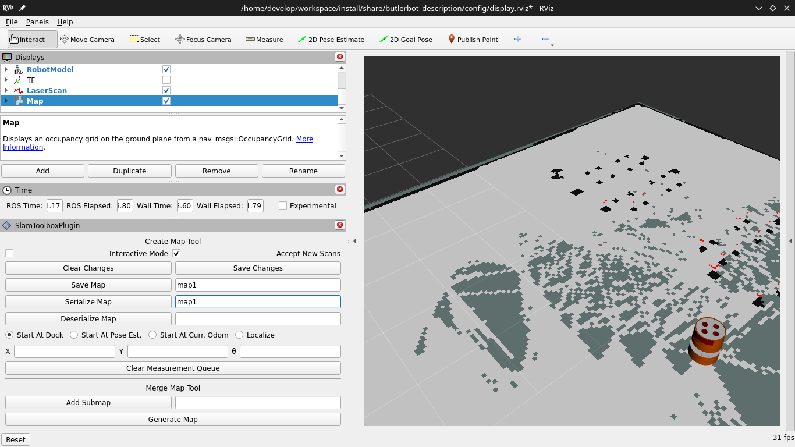

# Mapping

## Steps

1) Launch simulation

```
ros2 launch butlerbot_gazebo simulation.launch.py 
```


2) Edit slam toolbox config and launch slam toolbox

- change slam toolbox mode in config file `butlerbot_localization/config/mapper_params_online_async.yaml`

```
mode: mapping 
```

- and launch it
```
ros2 launch butlerbot_localization localization.launch.py
```

4) Save the map using `SlamToolboxPlugin Panel`




## [Video](https://drive.google.com/file/d/1HU8Ahrkit8VvELX2BE37y8AYtDEfPKH2/view?usp=sharing)