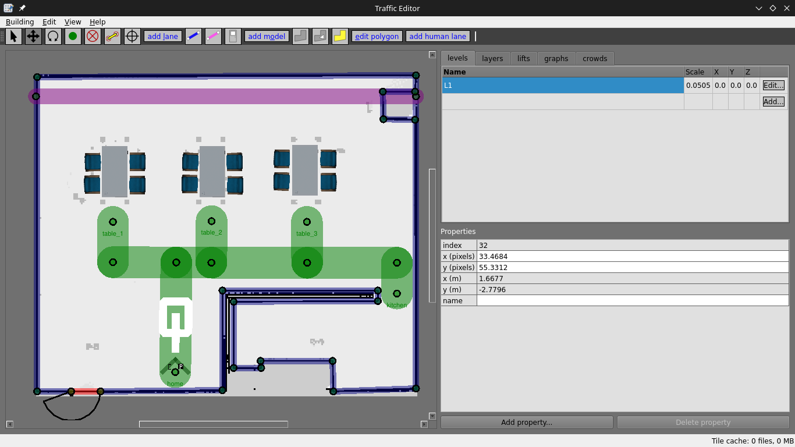
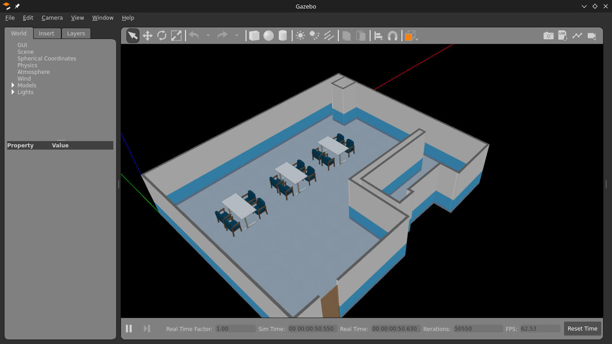

# OpenRMF 

## 1) Using `traffic-editor` to generate simulation world

-  we are using the previously generated map file using `slam_toolbox` to create and annotate 2D floor plans with robot traffic along with building infrastructure information using this tool




## 2) Generating world file

- By using the `*.building.yaml` file generated from `traffic-editor` to generate `.world` file.

```
cd butlerbot_rmf_gazebo/config/
ros2 run rmf_building_map_tools building_map_generator gazebo cafe.building.yaml cafe.world .
```
- Seperating worlds, models into different folders #TODO: configure this step in cmake

## 3) Creating a launch file to view this world in gazebo

- Launch the world generated using traffic editor
```
ros2 launch butlerbot_rmf_gazebo simulation.launch.py 
```

